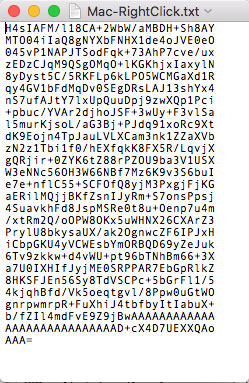
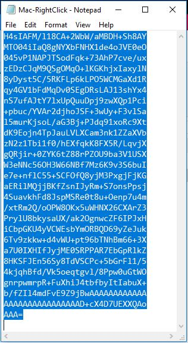
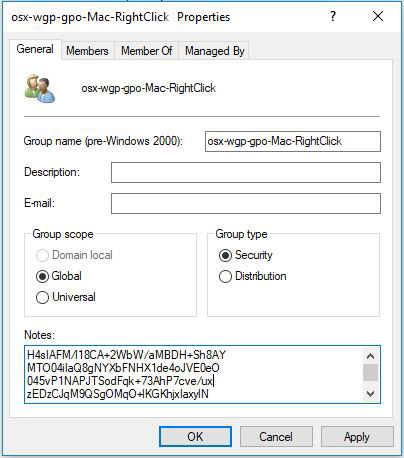
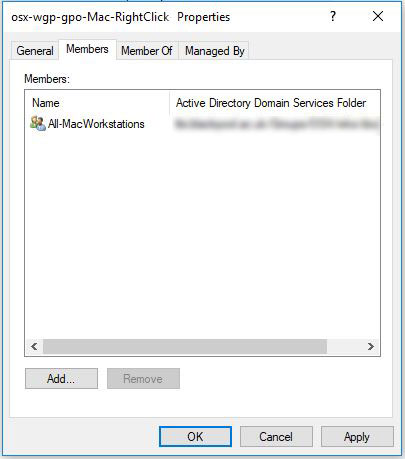
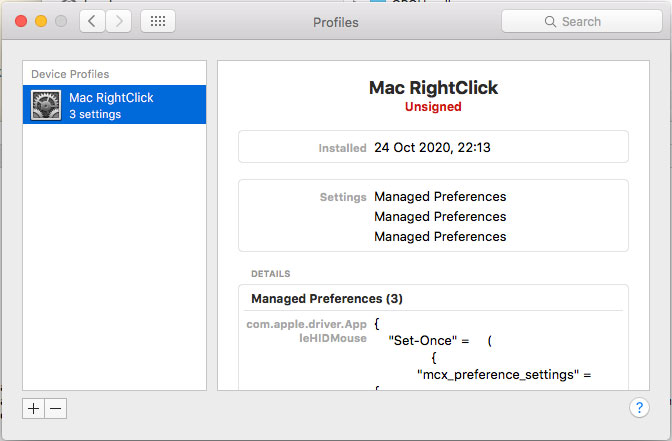
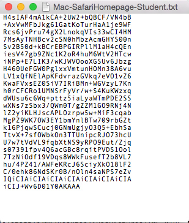
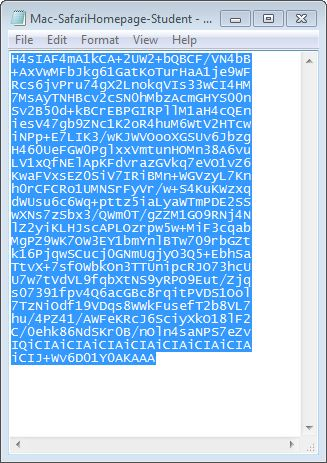
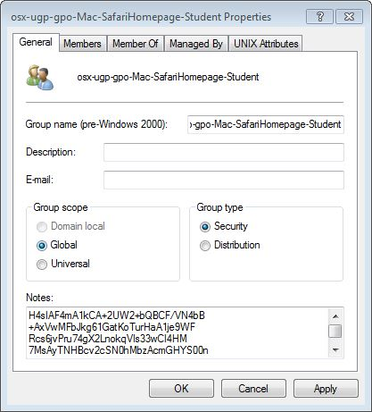
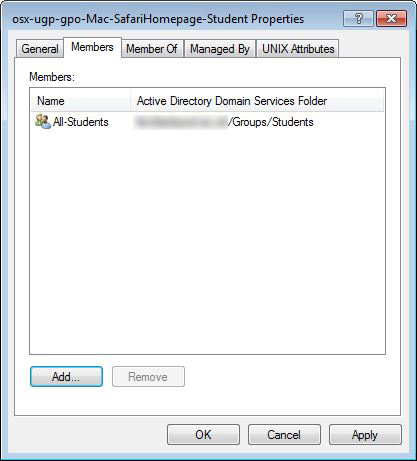
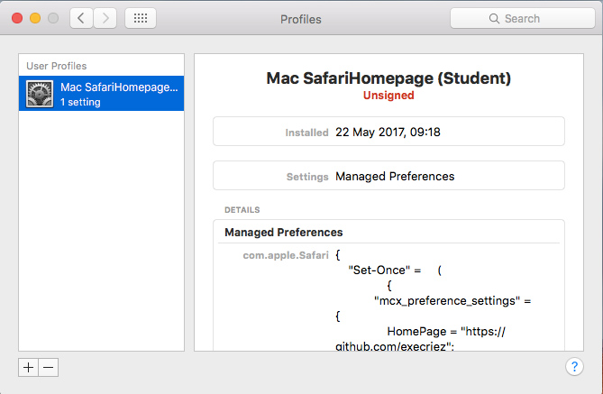

# LabNotes

## Brief

Distribute MacOS Policies to AD bound Macs via the Active Directory group notes field

## Introduction

LabNotes is an endpoint management tool for distributing MacOS policies to AD bound Macs. 

Policies are encoded and stored in the notes attribute of an AD group. Any Mac that has the LabNotes client software installed and is a member of the group, will pull the profile down and install the policy.

This effectively allows MacOS profiles to be stored directly within AD without having to extend the AD schema, and provides a mechanism to "scope" policies to specific users and workstations.

Please note, this code was originally part of the LabWarden project.

However, the ability to administratively install profiles from the command-line may be removed from future versions of MacOS making the LabNotes code legacy.

## Installation

[Download](https://github.com/execriez/LabNotes/archive/main.zip) the LabNotes zip archive, then unzip the archive on a Mac workstation.

Ideally, to install - you should double-click the [LabNotes.pkg](https://github.com/execriez/LabNotes/raw/main/SupportFiles/LabNotes.pkg) installer package which can be found in the "SupportFiles" directory.

If the installer package isn't available, you can run the command-line installer which can be found in the project "bin" directory:

	sudo Install

The installer will install the following files and directories:

	/Library/LaunchAgents/com.github.execriez.labnotes.deploypayloads.plist
	
	/Library/LaunchDaemons/com.github.execriez.labnotes.deploypayloads.plist
	/Library/LaunchDaemons/com.github.execriez.labnotes.gpupdate.plist
	
	/usr/LabNotes/

After installation, you should reboot.

## Uninstalling

To uninstall you should double-click the [LabNotes-Uninstaller.pkg](https://github.com/execriez/LabNotes/raw/main/SupportFiles/LabNotes-Uninstaller.pkg) uninstaller package which can be found in the "SupportFiles" directory.

	
If the uninstaller package isn't available, you can uninstall from a shell by typing the following:

	sudo /usr/local/LabNotes/bin/Uninstall

The uninstaller will uninstall the following files and directories:

	/Library/LaunchAgents/com.github.execriez.labnotes.deploypayloads.plist
	
	/Library/LaunchDaemons/com.github.execriez.labnotes.deploypayloads.plist
	/Library/LaunchDaemons/com.github.execriez.labnotes.gpupdate.plist
	
	/usr/LabNotes/

After you uninstall, you should reboot.
	

## Example 1

This example shows how to deploy the Mac-RightClick mobileconfig to a workstation or group workstations.

* If you haven't done so already, install [LabNotes](https://github.com/execriez/LabWarden/raw/master/SupportFiles/LabNotes.pkg) as per the installation instructions.
* Download (do not install) [Mac-RightClick.mobileconfig](https://raw.githubusercontent.com/execriez/Profiles/main/MacOS/Mac-RightClick.mobileconfig)

Next, in a shell type:

	/usr/local/LabNotes/bin/PackForDeployment ~/Desktop/Mac-RightClick.mobileconfig
	
Replace ~/Desktop/... with the location of the mobileconfig.

This will create a subfolder 'GPO' containing the packed version of the mobileconfig file. Take a look at the file.

>The file contains a compressed version of the policy in a form that can be copied into the Notes field of an AD group.
>
>

Move to a PC.

Open up the text file that we just created, then copy all the text.

>

Run a "Microsoft Management Console" (MMC) containing the "Active Directory Users and Computers" snap-in. 

Make sure you run the MMC as a user who has permission to create and edit AD groups, then create an AD group in a convenient OU.

In the example, I have named the group "osx-wgp-gpo-Mac-RightClick"

Open up the properties for the group. In the "General" tab, paste the text into the "Notes" field.

>

Select the "Members" tab and add a workstation, or group of workstations that you want to apply the policy to. This is the "Scope" of the policy.

>

Click "OK"

When you make a change to AD, there is generally a delay as the change is pushed around the domain controllers - so you may need to wait 10 to 15 minutes for the change to 'stick'.

Also, LabNotes only checks AD and updates policies at defined intervals. If you want to see the changes applied to a workstation immediately - do the following:

	Wait 10-15 minutes (typically)
	
	log into a Mac as a local admin user
	
	In a Terminal, type the following 
	
		sudo /usr/local/LabNotes/bin/gpupdate -force

>Because you chose to apply the policy to a workstation or group of workstations - the mobileconfig will be pulled down as a "Device Profile".
>
>
>
>If you had chosen to apply the policy to a user, or group of users - the mobileconfig would be pulled down as a "User Profile".

## Example 2

This example shows how to deploy the Mac-SafariHomepage MacOS mobileconfig to an AD user or group of AD users.

* If you haven't done so already, install [LabNotes](https://github.com/execriez/LabWarden/raw/master/SupportFiles/LabNotes.pkg) as per the installation instructions.
* Download (do not install) [Mac-SafariHomepage.mobileconfig](https://raw.githubusercontent.com/execriez/Profiles/main/MacOS/Mac-SafariHomepage.mobileconfig)

Open the file in a text editor.

Edit the file to change the "HomePage", then save as a new file called "Mac-SafariHomepage-student.mobileconfig".

	<key>mcx_preference_settings</key>
	<dict>
		<key>LastSafariVersionWithWelcomePage</key>
		<string>999.0</string>
		<key>HomePage</key>
		<string>https://github.com/execriez</string>
		<key>NewTabBehavior</key>
		<integer>4</integer>
		<key>NewWindowBehavior</key>
		<integer>0</integer>
	</dict>

Next, in a shell type:

	/usr/local/LabNotes/bin/PackForDeployment ~/Desktop/Mac-SafariHomepage.mobileconfig
	
Replace ~/Desktop/... with the location of the mobileconfig.

This will create a subfolder 'GPO' containing the packed version of the mobileconfig file. Take a look at the file.

>The file contains a compressed version of the policy in a form that can be copied into the Notes field of an AD group.
>
>

Move to a PC containing the "Microsoft Management Console" (MMC).

Open up the text file that we just created, then copy all the text.

>

Run a "Microsoft Management Console" (MMC) containing the "Active Directory Users and Computers" snap-in. 

Make sure you run the MMC as a user who has permission to create and edit AD groups, then create an AD group in a convenient OU.

In the example, I have named the group "osx-wgp-gpo-Mac-SafariHomepage-Student". 

Open up the properties for the group. In the "General" tab, paste the text into the "Notes" field.

>

Select the "Members" tab and add a user, or group of users that you want to apply the policy to. This is the "Scope" of the policy.

>

Click "OK"

When you make a change to AD, there is generally a delay as the change is pushed around the domain controllers - so you may need to wait 10 to 15 minutes for the change to 'stick'.

Also, LabNotes only checks AD and updates policies at defined intervals. If you want to see the changes applied to a workstation immediately - do the following:

	Wait 10-15 minutes (typically)
	
	log into a Mac as a network user
	
	In a Terminal, type the following 
	
		/usr/local/LabNotes/bin/gpupdate -force

>Because you chose to apply the policy to a user or group of users - the mobileconfig will be pulled down as a "User Profile" and installed when an associated user logs in.
>
>
>
>If you had chosen to apply the policy to a workstation, or group of workstations - the mobileconfig would be pulled down as a "Device Profile".

## Example 3

The Notes field in AD is limited to 1024 characters - so what do you do when you have a config that is too big to fit within this limit?

* If you haven't done so already, install [LabNotes](https://github.com/execriez/LabWarden/raw/master/SupportFiles/LabNotes.pkg) as per the installation instructions.
* Download (do not install) [Mac-UKLocale.mobileconfig](https://raw.githubusercontent.com/execriez/Profiles/main/MacOS/Mac-UKLocale.mobileconfig)

Next, in a shell type:

	/usr/local/LabNotes/bin/PackForDeployment ~/Desktop/Mac-UKLocale.mobileconfig
	
Replace ~/Desktop/... with the location of the mobileconfig.

This will create a subfolder 'GPO' containing the packed version of the mobileconfig file. Take a look at the file.

Take a look at in the folder. There are two files "Mac-UKLocale-0.txt" and "Mac-UKLocale-1.txt". The mobileconfig was too big to compress into a single 1024 byte file - so was split into two.

This is OK, we just need to copy the text into the Notes field of two groups and then make sure that the user or workstation is a member of both groups.

The most logical solution is actually to create three groups.

Run an MMC as a user who has permission to create and edit AD groups. Create the following two groups and copy the appropriate text into the relevant notes field:

	osx-wgp-gpo-Mac-UKLocale-0
	osx-wgp-gpo-Mac-UKLocale-1

Next create the following group, and make it a member of the previous two groups:

	osx-wgp-gpo-Mac-UKLocale

Any user or workstation that is a member of the osx-wgp-gpo-Mac-UKLocale group, will get the complete mobileconfig.

## History

3.2.2 - 02-Jan-2021

* Fixed bug in /bin/deploypayloads that assumed "/Library/Managed Prefs" always exists. If a profile has never been installed, this directory doesn't exist.

3.2.1 - 05-Nov-2020

* Project preferences have been relocated to (~)/Library/preferences/com.github.execriez.labnotes . The old preferences folder will be deleted if found.

* User gpos are now downloaded by running gpupdate as the user.

3.2.0 - 24-Oct-2020

* First public release.

* This code was lifted and removed from the LabWarden project, hence the version number. Note, the LabNotes code is disabled if a version of LabWarden prior to 3.2.0 is found to be installed.

